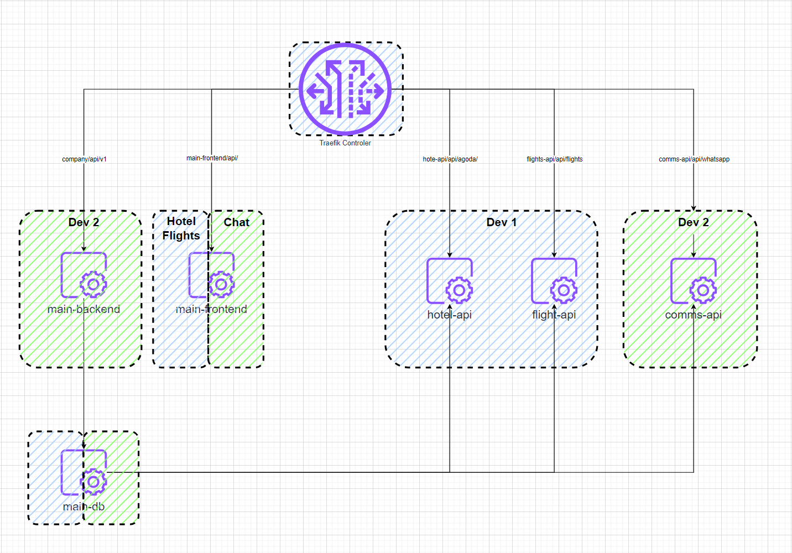

## Contact

For any questions, feel free to reach out on Discord: 

# Objective Dev 1 

The main task is to implement a WhatsApp API service using Docker and integrate the WhatsApp Web API into the LizAnt UI React template provided.

## Chat Deliverables:

- A K8 + ingress controller configuration for whatsapp chat API service (comms-api)
- Configure endpoints and link the LizAnt cat UI template to comms-api thrugh ingress. 
- PostgreSQL database configuration for chat related data shared between users.

### Features:
- **Backend** - WuzAPI - an implementation of [@tulir/whatsmeow](https://github.com/tulir/whatsmeow) library as a simple RESTful API service with multiple device support and concurrent sessions.

## Architecture Description

The application architecture is designed to be modular and scalable, leveraging microservices and containerization. Here is a detailed description of each component:

### Proposed Architecture Components

1. **main-frontend**:
    - We are using the LizAnt react template for the main project athough diferent templaets may be provided for individual components. See templates inside ./templates/
    - Uses main-frontend/api/ endpoint

2. **main-backend**:
    - Manages user sessions, authentication, and core functionalities.
    - Uses company/api/v1/ endpoint
  
3. **comms-api**:
    - Manages chat functionality, including message storage, retrieval, and real-time updates.
    - Integrates with the existing Go backend for user authentication.
    - Uses comms-api/api/whatsapp/ endpoint

4. **Database (PostgreSQL)**:
    - Stores user data, chat messages, and other related information.
  
5. **Controller**:
    - Manages and routes requests to the appropriate services. you can use 
    - https://hub.docker.com/_/traefik

6. **Docker Compose**:
    - Manages multi-container Docker applications.

## Scenarios

There is an organization with multiple users using the React web-app.

1. **Register WhatsApp web** - The user must log in and receive a QR code to register WhatsApp web. users are registered via user_ref table in sql.
2. **De-Register WhatsApp web** - The user must be able to de-register WhatsApp web.
3. **Cat Load and Contact Merge** - WhatsApp web API is called to retrieve all contacts and historical chats. There is a pre-existing contacts table available in MySQL. The engine must join the data sets by phone numbers and identify matches.
5. **Multiple Users** - Multiple users use the same WhatsApp backend and are able to use the chat functionality offered by WuzAPI.
6. **Decoupled Backends** - We have the main-backend in Go which powers the React UI logic. This is outside the realm of this project. The WhatsApp API (comms-api) service should be independent and all api calls routed through ingress controller - can be nginx for dev but traefik is the final solution. 
7. **Postgres DB** - By default, WuzAPI is configured to use SQLite, but this implementation of [@tulir/whatsmeow](https://github.com/tulir/whatsmeow) library also supports PostgreSQL. A separate container running PostgreSQL must be deployed to support any CRUD operations from WuzAPI.

## MySQL Schema Credentials with Data Example

You can check some dummy data and data model using the credentials here:

- **MySQL Database:**
  - User: `engadev`
  - Password: `userengadev`
  - Host: `45.8.149.43:3306`
  - Schema: `data_feeds`
  - Use/insert credentials from the table: `user_ref` for login screen

## Notes on the Data

1. You can deploy a copy of the database locally by running `db/db_dump_file.sql`.
2. Once the cat app is connected via QR code, it should automatically pull in and populate the `contact_whatsapp` table with all available contacts from WhatsApp.
3. The table `tag_ref` includes available tags which should be fed into the contact card - see Enhance the contact requirements in the frontend section.
4. There is a `tag_id` field in `contact_ref` which should be displayed on the contact card in the chat app.
5. All chat data should be stored.
6. There are 3 available users in `user_ref` and they provide the login credential information for the web app.
7. Be able to add a contact from the chat app via the + button; this should populate `contact_ref`.

## Stack

- Golang + Fiber
- ReactJS

## Backend

- Use Golang with Fiber and GORM frameworks.

## Chat Frontend

- Use the LizAnt Ant Design React Admin Dashboard template. This is already in a functioning state deployed with the Go backend. It currently only does some hotel search to Rapid API, the rest of the template is still inside.
- Modify the chat box for better screen fit.
- Add a favorites section to pin contacts.
- Enhance the contact card to integrate user-specific information and tags from the database.
- **Admin Screen:** Create a page where a user can request a QR code and register their WhatsApp. This page will handle the output from the WhatsApp service for QR code registration.
- **Chat App:** Develop a chat application for users to communicate. Ensure it can handle 3-4 concurrent users.

## Deployment

- Deploy using K8 
- Ensure the app handles 3-10 concurrent users with unique phone numbers for testing.
